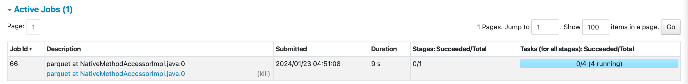
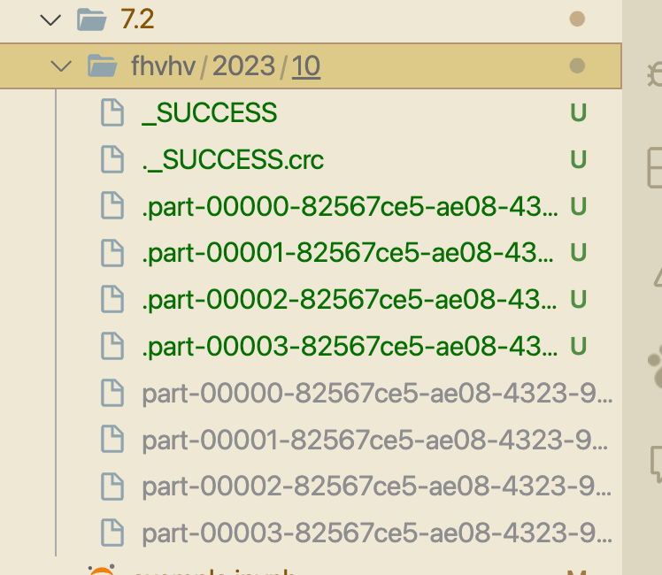

Unlike pandas, spark doesnt try to store the datatypes of the columns in the dataframe. It just stores the data as a binary format. So, when we read the data, we need to specify the schema of the data. This is done by using the StructType and StructField classes. The StructType class is used to define the schema of the dataframe. The StructField class is used to define the schema of each column of the dataframe. The StructField class takes in the following parameters:
- name: The name of the column
- dataType: The datatype of the column
- nullable: Whether the column can contain null values or not
- metadata: Any additional information about the column

```python
data.schema
```

```text
SStructType(
            [StructField('hvfhs_license_num', StringType(), True),
            StructField('dispatching_base_num', StringType(), True),
            StructField('originating_base_num', StringType(), True),
            StructField('request_datetime', TimestampNTZType(), True),
            StructField('on_scene_datetime', TimestampNTZType(), True),
            StructField('pickup_datetime', TimestampNTZType(), True),
            StructField('dropoff_datetime', TimestampNTZType(), True),
            StructField('PULocationID', IntegerType(), True),
            StructField('DOLocationID', IntegerType(), True),
            StructField('trip_miles', DoubleType(), True),
            StructField('trip_time', LongType(), True),
            StructField('base_passenger_fare', DoubleType(), True),
            StructField('tolls', DoubleType(), True),
            StructField('bcf', DoubleType(), True),
            StructField('sales_tax', DoubleType(), True),
            StructField('congestion_surcharge', DoubleType(), True),
            StructField('airport_fee', DoubleType(), True),
            StructField('tips', DoubleType(), True),
            StructField('driver_pay', DoubleType(), True),
            StructField('shared_request_flag', StringType(), True),
            StructField('shared_match_flag', StringType(), True),
            StructField('access_a_ride_flag', StringType(), True),
            StructField('wav_request_flag', StringType(), True),
            StructField('wav_match_flag', StringType(), True)
])

```

```python
from pyspark.sql import types
schema = types.StructType([
    types.StructField('hvfhs_license_num', types.StringType(), True),
    types.StructField('dispatching_base_num', types.StringType(), True),
    types.StructField('originating_base_num', types.StringType(), True),
    types.StructField('request_datetime', types.TimestampType(), True),
    types.StructField('on_scene_datetime', types.TimestampType(), True),
    types.StructField('pickup_datetime', types.TimestampType(), True),
    types.StructField('dropoff_datetime', types.TimestampType(), True),
    types.StructField('PULocationID', types.IntegerType(), True),
    types.StructField('DOLocationID', types.IntegerType(), True),
    types.StructField('trip_miles', types.DoubleType(), True),
    types.StructField('trip_time', types.LongType(), True),
    types.StructField('base_passenger_fare', types.DoubleType(), True),
    types.StructField('tolls', types.DoubleType(), True),
    types.StructField('bcf', types.DoubleType(), True),
    types.StructField('sales_tax', types.DoubleType(), True),
    types.StructField('congestion_surcharge', types.DoubleType(), True),
    types.StructField('airport_fee', types.DoubleType(), True),
    types.StructField('tips', types.DoubleType(), True),
    types.StructField('driver_pay', types.DoubleType(), True),
    types.StructField('shared_request_flag', types.StringType(), True),
    types.StructField('shared_match_flag', types.StringType(), True),
    types.StructField('access_a_ride_flag', types.StringType(), True),
    types.StructField('wav_request_flag', types.StringType(), True),
    types.StructField('wav_match_flag', types.StringType(), True)
```

```python
data = spark.read\
    .option("header", True)\
    .schema(schema)\
    .csv("yellow_tripdata_2023-10.parquet")
```


```python
data.repartition(25)
```
Its called a lazy command, it doesnt trigger anything. It just tells spark that when you do something, do it with 25 partitions.

```python
data.write.parquet('fhvhv/2023/10')
```
When this line is executed, Spark will first repartition the DataFrame into 25 partitions as per command. Then, it will write the data into a Parquet file at the specified path ('fhvhv/2023/10').

Parquet is a columnar storage file format that is optimized for use with big data processing frameworks like Apache Spark. The data is stored in a way that allows for efficient data compression and encoding schemes. The data can be read back efficiently as well.

The repartitioning step can help improve the performance of the write operation by distributing the data across multiple nodes in the Spark cluster, allowing the write operation to be performed in parallel.



