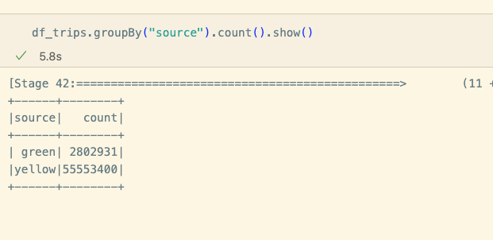

# SQL in Spark

## Preparing the data

Run this script to download the data and create the tables:

```bash
set -e

TAXI_TYPES=("yellow" "green")
YEAR=2020

# https://d37ci6vzurychx.cloudfront.net/trip-data/yellow_tripdata_2023-09.parquet
# https://d37ci6vzurychx.cloudfront.net/trip-data/green_tripdata_2023-09.parquet

URL_PREFIX="https://d37ci6vzurychx.cloudfront.net/trip-data"
for TAXI_TYPE in ${TAXI_TYPES[@]}; do
    echo "Scraping ${TAXI_TYPE} data for ${YEAR}"
    for MONTH in {1..12}; do

        FMONTH=`printf "%02d" ${MONTH}`

        URL="${URL_PREFIX}/${TAXI_TYPE}_tripdata_${YEAR}-${FMONTH}.parquet"
        echo $URL
        LOCAL_PREFIX="data/raw/${TAXI_TYPE}/${YEAR}/${FMONTH}"
        LOCAL_FILE="${TAXI_TYPE}_tripdata_${YEAR}_${FMONTH}.parquet"
        LOCAL_PATH="${LOCAL_PREFIX}/${LOCAL_FILE}"

        echo "downloading ${URL} to ${LOCAL_PATH}"
        mkdir -p ${LOCAL_PREFIX}
        wget ${URL} -O ${LOCAL_PATH}

    done
done
```


Yellow Taxi Schema

```pyspark
df_yellow.printSchema()

root
 |-- VendorID: long (nullable = true)
 |-- tpep_pickup_datetime: timestamp_ntz (nullable = true)
 |-- tpep_dropoff_datetime: timestamp_ntz (nullable = true)
 |-- passenger_count: double (nullable = true)
 |-- trip_distance: double (nullable = true)
 |-- RatecodeID: double (nullable = true)
 |-- store_and_fwd_flag: string (nullable = true)
 |-- PULocationID: long (nullable = true)
 |-- DOLocationID: long (nullable = true)
 |-- payment_type: long (nullable = true)
 |-- fare_amount: double (nullable = true)
 |-- extra: double (nullable = true)
 |-- mta_tax: double (nullable = true)
 |-- tip_amount: double (nullable = true)
 |-- tolls_amount: double (nullable = true)
 |-- improvement_surcharge: double (nullable = true)
 |-- total_amount: double (nullable = true)
 |-- congestion_surcharge: double (nullable = true)
 |-- airport_fee: integer (nullable = true)

```

Green Taxi Schema

```pyspark
df_green.printSchema()

root
 |-- VendorID: long (nullable = true)
 |-- lpep_pickup_datetime: timestamp_ntz (nullable = true)
 |-- lpep_dropoff_datetime: timestamp_ntz (nullable = true)
 |-- store_and_fwd_flag: string (nullable = true)
 |-- RatecodeID: double (nullable = true)
 |-- PULocationID: long (nullable = true)
 |-- DOLocationID: long (nullable = true)
 |-- passenger_count: double (nullable = true)
 |-- trip_distance: double (nullable = true)
 |-- fare_amount: double (nullable = true)
 |-- extra: double (nullable = true)
 |-- mta_tax: double (nullable = true)
 |-- tip_amount: double (nullable = true)
 |-- tolls_amount: double (nullable = true)
 |-- ehail_fee: integer (nullable = true)
 |-- improvement_surcharge: double (nullable = true)
 |-- total_amount: double (nullable = true)
 |-- payment_type: double (nullable = true)
 |-- trip_type: double (nullable = true)
 |-- congestion_surcharge: double (nullable = true)

```

Schemas are alittle different, so we will need to do some data cleaning

after renaming the columns, we can union the two dataframes together but we have to identify from which dataframe the data came from

using  pyspark.sql.functions, we can add a column to identify the data source

```pyspark
from pyspark.sql.functions import lit
df_green = df_green.withColumn("source", lit("green"))
```

```pyspark
# Get the common columns
common_columns = set(df_yellow.columns) & set(df_green.columns)

# Use the set to select the common columns from df_yellow
df_yellow_common = df_yellow.select(*common_columns)

# Use the set to select the common columns from df_green
df_green_common = df_green.select(*common_columns)
```

The set(df_yellow.columns) & set(df_green.columns) expression actually returns a set, not a dictionary. A set in Python is a collection of unique elements, similar to a list or tuple, but it does not have any order and cannot contain duplicate elements.

When we use the * operator before a collection in Python (like a list, tuple, or set), it "unpacks" the collection. This means it treats each element of the collection as a separate argument.

For example, if we have a set like {'a', 'b', 'c'}, using * to unpack it would be equivalent to passing the arguments as 'a', 'b', 'c'.

So, when we use df_yellow.select(*common_columns), it's equivalent to passing each column name in common_columns as a separate argument to the select method. This is necessary because the select method expects each column name to be a separate argument.




## Writing SQL Queries

First we have to tell spark that our dataframes are tables

```pyspark
df_trips.createOrReplaceTempView("trips")
```

Then we can write SQL queries

```pyspark
spark.sql("""
        SELECT source, COUNT(*) AS count
        FROM trips
        GROUP BY source
""")
```

