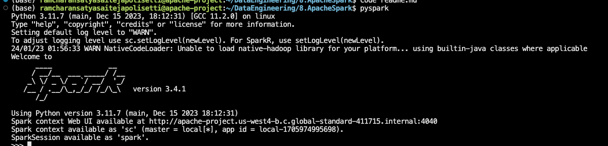
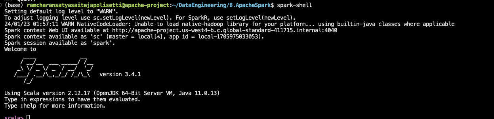

# Installation

1. Install conda
2. Create a conda environment

Follow this article to install [Apache Spark](https://medium.com/@divya.chandana/easy-install-pyspark-in-anaconda-e2d427b3492f)on Ubuntu 

3. Install OpenJDK 
4. Install Apache Spark
5. Test the installation
```bash
pyspark
```


or 

```bash
spark-shell
```
