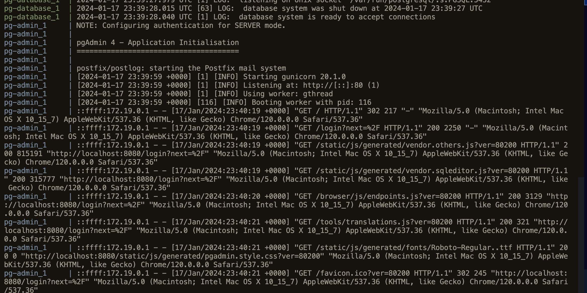

# Docker Compose

- By default Docker Compose comes preinstalled with Docker in mac and Windows.
- It is used to specify one file for all the cofigurations for the containers as it is inconvinient to specify multiple files for each container.
  - All the configurations for the containers will be specified in one `YAML` file.

```bash
docker-compose
```

```bash
    volumes:
      - ./ny_taxi_postgres_data:/var/lib/postgresql/data:rw
```

- ./ny_taxi_postgres_data -> hostpath
- /var/lib/postgresql/data -> container path
- rw -> mode (No need to specify it explicitly)

```yaml
services:
  pg-database:
    image: postgres:13
    environment:
      - POSTGRES_USER=root 
      - POSTGRES_PASSWORD=root 
      - POSTGRES_DB=ny_taxi 
    volumes:
      - "./ny_taxi_postgres_data:/var/lib/postgresql/data:rw"
    ports:
      - "5432:5432"
    networks:
      - pg-network

  pg-admin:
   image: dpage/pgadmin4
   environment:
    - PGADMIN_DEFAULT_EMAIL=admin@admin.com
    - PGADMIN_DEFAULT_PASSWORD=root
   volumes:
    - "./pgadmin_data:/var/lib/pgadmin"
   ports:
    - "8080:80"
   networks:
      - pg-network
   
networks:
  pg-network:
    driver: bridge

```

Change permissions to this folder 

- "./pgadmin_data:/var/lib/pgadmin"

- No need to specify the network interface. It will happen automatically.

```bash
docker-compose up
```

Running in Detached mode

```bash
docker-compose up -d 
```




```bash
docker run -it --network=dockercompose_pg-network taxi_ingest:v001 \
--user=root \
--password=root \
--host=pg-database \
--port=5432 \
--database=ny_taxi \
--table=yellow_taxi_data \
--url="https://d37ci6vzurychx.cloudfront.net/trip-data/yellow_tripdata_2023-10.parquet"

```

Here '--network=dockercompose_pg-network' is the name of the network created by docker-compose.

Shutting down docker-compose

```bash
docker-compose down
```
