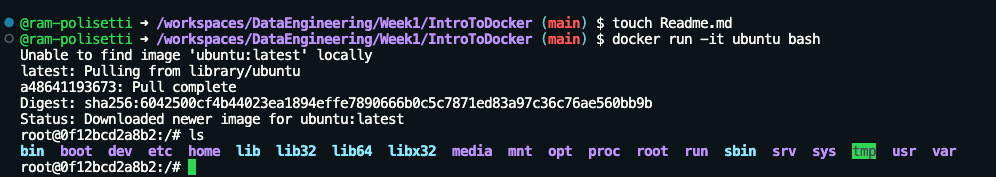

- docker run -it ubuntu bash
    - -it -> runs the image in interactive mode 
    - 
    - Everything that comes after the image name is a parameter(in this case: bash)
- exit -> to exit the docker
- docker ps -> shows all running containers
- docker stop [container ID] -> stops the container with the given ID
- docker rm [container ID] -> removes/deletes the container with the given ID
  
 ### Another  Example
 - docker run -it --entrypoint=bash python:3.9
    - --entrypoint -> what exactly is executed first when we run the container 
      - it lets you install packages or libraries inside the container 
      - just enter python in the terminal after installing the packages
  

  # Creating Docker
  - docker build -t test:pandas . 
    - -t test:pandas -> image name
    - . -> docker looks for Dockerfile in the current directory
  