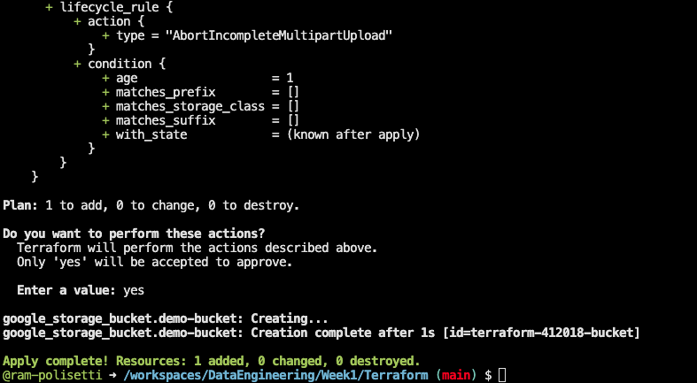

# Installation Steps for HashiCorp Terraform

**Step 1:** Ensure that your system is up to date and have installed the required packages:

```shell
sudo apt-get update && sudo apt-get install -y gnupg software-properties-common
```

**Step 2:** Install the HashiCorp GPG key:

```shell
wget -O- https://apt.releases.hashicorp.com/gpg | \
gpg --dearmor | \
sudo tee /usr/share/keyrings/hashicorp-archive-keyring.gpg
```

**Step 3:** Verify the key's fingerprint:

```shell
gpg --no-default-keyring \
--keyring /usr/share/keyrings/hashicorp-archive-keyring.gpg \
--fingerprint
```

The gpg command will report the key fingerprint, which you should verify.

**Step 4:** Add the official HashiCorp repository to your system:

```shell
echo "deb [signed-by=/usr/share/keyrings/hashicorp-archive-keyring.gpg] \
https://apt.releases.hashicorp.com $(lsb_release -cs) main" | \
sudo tee /etc/apt/sources.list.d/hashicorp.list
```

**Step 5:** Download the package information from HashiCorp:

```shell
sudo apt update
```

**Step 6:** Install Terraform from the new repository:

```shell
sudo apt-get install terraform
```

After following these steps, you can verify the installation by running Terraform commands. For example:

**Verify Terraform installation:**

```shell
terraform -help
```

This will display Terraform's available subcommands. You can use the `-help` flag with any subcommand to learn more about what it does and available options. For example:

**Learn more about the "plan" subcommand:**

```shell
terraform -help plan
```

These steps will help you install and verify Terraform on your system.

Now visit [https://registry.terraform.io/providers/hashicorp/google/latest/docs](https://registry.terraform.io/providers/hashicorp/google/latest/docs) to learn more about the Google provider for Terraform.

and copy the following

```terraform
terraform {
    required_providers {
        google = {
        source = "hashicorp/google"
        version = "5.13.0"
        }
    }
}

provider "google" {
    # Configuration options
    project     = "my-project-id"
    region      = "us-central1"
}
```

Use this command to format the code

```bash
 terraform fmt
```

## Installing the google provider

Use this [resource](https://cloud.google.com/sdk/docs/install#deb) for the installation of the google provider

```bash
gcloud init
```

```bash
export GOOGLE_CREDENTIALS='/workspaces/DataEngineering/Week1/Terraform/keys/my_creds.json'
```

```bash
terraform init
```


Now create a bucket in GCP

follow this [link](https://registry.terraform.io/providers/hashicorp/google/latest/docs/resources/storage_bucket)

then update the main.tf file

```terraform
resource "google_storage_bucket" "demo-bucket" {
  name          = "terraform-412018-bucket"
  location      = "US"
  force_destroy = true

  # lifecycle_rule {
  #   condition {
  #     age = 3
  #   }
  #   action {
  #     type = "Delete"
  #   }
  # }

  lifecycle_rule {
    condition {
      age = 1
    }
    action {
      type = "AbortIncompleteMultipartUpload"
    }
  }
}
```

```bash
terraform plan
```


```bash
terraform apply
```

terrform apply will create the bucket in GCP and creates a state file in the local machine




```bash
terraform destroy
```

the resources will be deleted from GCP and resources from the state file will be deleted from the local machine and a backup file will be created.


